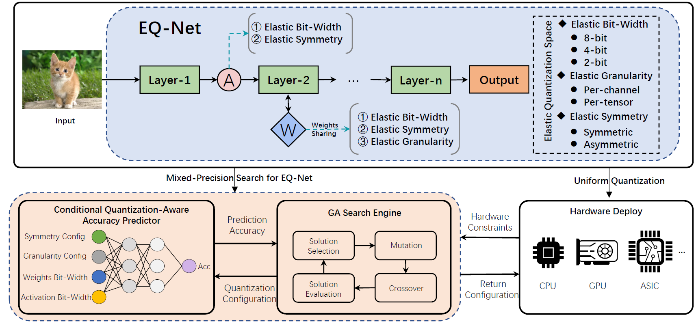

# EQ-Net: Elastic Quantization Neural Networks

Code for EQ-Net: Elastic Quantization Neural Networks accepted by ICCV2023



## Requirements

- Python = 3.8
- PyTorch = 1.13.0
- yacs = 0.1.8
- simplejson = 3.17.6

## Run example

### Config Preparation

We give a config sample under the [configs](./configs/) folder.

### Training

Train Supernet(Multi-GPU only)

```sh
python train_supernet.py --cfg cfg_path
```

### Evaluation

Download the Trained Supermodel [Google-Drive](https://drive.google.com/drive/folders/1xus7JbqmEkYyQqGHos0iOjJqQ1s2f9Cc?usp=sharing) / [BaiduDisk](https://pan.baidu.com/s/1ej9oeQdKiPdeNybIR0_alg?pwd=6666)

Please fill in the trained Supernet model path in the configuration file, then run
```sh
python eval_supernet.py --cfg cfg_path
```

## Thanks

Part of the code references [pytorch-BigNAS](https://github.com/xfey/pytorch-BigNAS) and [LSQplus](https://github.com/ZouJiu1/LSQplus). Please ref to their reposity for more details.